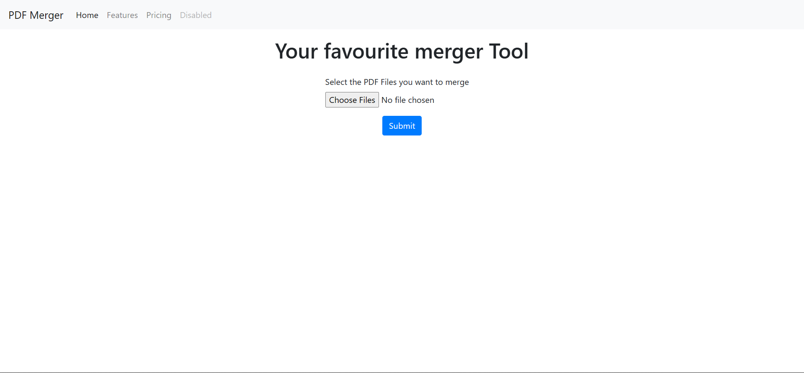

# A 2 PDF Merger using HTML, CSS, Express JS. 

<h3> You have to give 2 PDF's as input.</h3>

<h3> Click on Submit button to submit those PDF's.</h3>

<h3> As you submit the new PDF will appear by name merged.pdf and this pdf is the combination of selected PDFs</h3>

# Working of this Project

<h3> You can follow me on Instagram for various projects on web development and basic DSA questions</h3>

